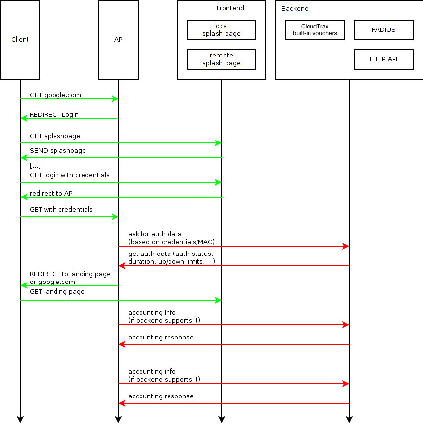

# Captive Portal

A captive portal acts as a controlled gateway to the web. Any attempt to browse the web over a WiFi connection controlled by the portal is intercepted; code running on the portal can then regulate which users are allowed web access, to which pages, and under which conditions. Typically users are initially redirected to a special splash page for logging in. 

With CloudTrax, the actions of the portal are defined by Open-Mesh code code running on an Access Point (AP). An attempt to browse the web via the Access Point will trigger the portal code and initiate the HTTP message flow below.

The CloudTrax Captive Portal lets you configure two types of [Splash Pages](./splash_pages), hosted internally on CloudTrax or externally using UAM. These are shown in the box labeled "Frontend" in the diagram below.

These splash pages can be used with a variety of [Authentication Services](./authentication), including a built-in vouchering system, RADIUS servers, and backend HTTP API-based Authentication Servers of your own. These services are shown in the box labeled "Backend" in the diagram below. 

This sequence diagram provides an architectural overview, both of the front and back-end components that are available, as well as the HTTP transactions flowing between them, the client's browser, and CloudTrax Access Points.

 

 

