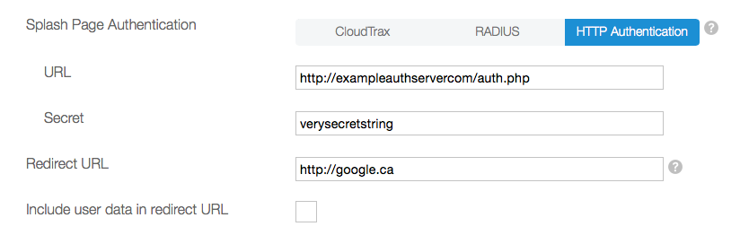

# HTTP Authentication API 

*This is preliminary documentation. It applies only to networks running under CloudTrax 4.*


#### Contents of this document ####

* [Overview](#overview)
    * [HTTP Request and Response](#tech-details)
    * [Example request](#example-request)
    * [Example response](#example-response)
* [Configuration](#config)
	* [Providing a login panel](#login-panel)
	* [Other configuration parameters](#other-config-params)
* [Request Authenticator](#ra)
* [Password decoding](#password)
* [API functions](#api-operations)
    * [status](#status)
    * [login](#login)
    * [acct](#acct)
    * [logout](#logout) 

---

### Introduction ###

This document describes the  CloudTrax **HTTP Authentication API** (**HTTP API** for short), a simple and straightforward authentication protocol that allows your Access Point code to hand off the task of authenticating new users to a backend authentication server of your own devising, (referred to as the **Authentication Server** in the following).  The Authentication Server needs to implement the protocol described in this document to tell your Access Points who is allowed to use the service and what some of the basic operating parameters should be.

CloudTrax offers several types of protocols for third-party authentication.  The HTTP API is one. Another is the RADIUS API protocol, which hands off the task of backend authentication to a RADIUS server. The difference between RADIUS and the HTTP Authentication API is that all RADIUS-based authentication parameters need to be preconfigured directly on the RADIUS server. The HTTP Authentication API, on the other hand, allows you to handle all aspects of the authentication process at runtime yourself, giving you total control over that process.

---

 <a name="overview"></a>

### Overview ###

The protocol details three types of interaction between an **Access Point** ("AP") and the backend Authentication Server. These three interactions, from a high-level perspective, correspond to the following sequence of events in the authentication lifecycle:

* Code on an Access Point detects a user device attempting to make gain access through one of its SSID's that has been configured using CloudTrax to use this protocol (see [Configuration](#config).) The AP sends a **Status Request** as part of a "preauthentication check" to the Authentication Server, asking if the device has been previously authenticated. If the Authentication Server responds that the device has not (ie, it is unknown), the AP posts the splash screen containing a login panel. This would have also been previously configured.
* Once the user enters his or her credentials and presses the Login button, the AP issues a **Login Request**, passing those credentials to the Authentication Server. If the server doesn't recognize the credentials, it lets the Access Point know that the authentications/login request has been rejected, and that's the end of it.
* If the server accepts the credentials, it lets the AP know that the user/device is now authenticated. The Access Point will then either redirect to the web page the user was originally attempting to access, or redirect the user to an alternate "redirect" web page that was specified in the CloudTrax configuration for HTTP Authentication. The response from the Authentication Server to the Login Request also specifies to the Access Point the amount of time in seconds the user is to be considered authenticated. Following the expiration of that time, the AP is expected to reissue a Status Request, to start the entire process all over again.
* During the session, the AP will periodically issue **Accounting Request** messages to the Authentication Server. These keep the Authentication Server informed of the number of bytes uploaded and downloaded by the client during the current session, as well as the amount of time that has passed since the user was authenticated.

<a name="tech-details"></a>
### HTTP Request and Response ###

The HTTP API uses standard **HTTP Requests** to communicate between the Access Point and the Authentication Server. HTTPS is not currently supported. The base HTTP URL of the Authentication Server is specified in the CloudTrax [Configuration](#config). Query string parameters are added to this URL by the Access Point when making requests to report or request specific information from Authentication Server.

A query-string contains one or more name-value pairs of the form `param-name=param-value`. All HTTP Requests issued by this protocol use the HTTP GET method. All query-string parameters must be url-encoded. (Refer to [RFC 3986](http://www.rfc-editor.org/rfc/rfc3986.txt) for details.)

The Authentication Server responds to the request by returning information in a standard **HTTP Response**. This consists of an **HTTP message body**, a multiline body of text encoded as `text/plain`, each line of which contains a name-value pair similar to the parameters in the Request's query-string, although in a slightly different format. 

<a name="example-request"></a>
### Example request ###

Here's a sample ***Login Request*** asking that user "TEST.USER", with a password encoded by the Access Point, be authenticated and logged-in to use the Open-Mesh WiFi network. The fact that this is a Login Request is indicated by the `type=login` name-value pair in its query-string.

````
GET http://exampleauthserver.com/auth.php?type=login&username=TEST.USER&password=87BC4E314689b55d89B&ra=949689087314689b55d89b1980aeff3f&mac=02:BA:DE:AF:FE:01&node=02:BA:DE:AF:FE:01
````

The URL of the backend server ("http://exampleauthserver.com/auth.php") was stored by CloudTrax during the initial [Configuration](#config) process, so that CloudTrax knows how to address the server during API calls. The URL's *path* ("/auth.php" in the above) provides the path on the server to the code that implements the backend component of this protocol. 

The `username` and `password` data transmitted as part of this request ("TEST.USER" and "87BC4E314689b55d89B" respectively) were provided by the user entering their credentials in the splash screen that was posted by the Access Point. (See [Providing a login panel](#login-panel) for instructions on how to configure the login form).

The `mac` and `node` parameters in the query-string are two other parameters to the Login Request and are explained in the section on [logging in](#login). The `ra` parameter, standing for [Request Authenticator](#ra), is  particularly important for maintaining security during handshaking under this protocol and is transmitted as a part of all authentication requests.

### Example response ###

 Given the above Login Request, the Login Response's message body might look something like the following. Note that the parameter name and its value on each line are both enclosed in double quotes, and that both names and values must be url-encoded. 
 
 <pre>
"CODE" "ACCEPT"
"RA" "1fb341292217da85e097f05f3c75b672"
"SECONDS" "3600"
"DOWNLOAD" "2000"
"UPLOAD" "800"
</pre>

  The name-value pair on the first line of the message body:
 
 ````
"CODE" "ACCEPT"
 ````
   
indicates that the user has been authenticated. The "DOWNLOAD" and "UPLOAD" parameters indicate the maximum throughputs in the indicated direction in kilobytes/second, while "SECONDS" indicates the number of seconds the login is to remain valid. These are discussed in detail in the section [below](#login).

If the authentication server did not recognize the user's credentials, the response might look like this:

````
"CODE" "REJECT"
"RA" "82f1e02d2a635dfa5dd459ede4395c3e"
"BLOCKED_MSG" "Invalid%20username%20or%20password"
````
The applicable name-value pairs for both Authentication Requests and Responses are given below for all [API functions](#api-operations).

<a name="config"></a>
## Configuration ##

If you intend to use HTTP Authentication, you need to provide several key pieces of information to CloudTrax in advance. You'll do this in the Configuration panel that's displayed in the CloudTrax dashboard when configuring for authentication. 

<a name="login-panel"></a>
#### Providing a login panel ####
If your users are going to be logging in from a CloudTrax-hosted "custom" splash page, you'll need to make sure that splash page contains an HTTP-Authentication-compatible login form. Refer to [Custom Splash Pages](../../splash_pages/custom)  for details.

<a name="other-config-params"></a>
#### Other configuration parameters ####
Here's the rest of the Configuration panel you'll need to update when configuring for HTTP Authentication, with an explanation of the fields you'll be editing:




##### URL #####
The full URL that is used in the authentication API call is formed by appending the query-string appropriate to that request to the URL specified above. The URL must point to a standard HTTP server. HTTPS is not currently supported. For a Login Request for example, we have:

Configured URL: `http://exampleauthserver.com/auth.php` <br/>
Full URL:`GET http://exampleauthserver.com/auth.php?type=login&username=TEST.USER&password=87BC4E314689b55d89B&ra=949689087314689b55d89b1980aeff3f&mac=02:BA:DE:AF:FE:01&node=02:BA:DE:AF:FE:01`

##### secret #####
On entry here, this secret is shared between CloudTrax and the backend Authentication Server. Both sides maintain identical copies; it is *never* transmitted in either direction between them during handshaking, encoded or otherwise.

<a name="ra"></a>
## Request Authenticator ##
All Authorization Requests contain an `ra` parameter. "ra" stands for **Request Authenticator**, a unique 128-bit (16-byte) string, which is used to help protect against so-called Man-in-the-Middle attacks. The Request Authenticator that is passed by CloudTrax to the Authentication Server needs to be transformed to a new RA by the algorithm discussed below and returned as part of the HTTP Response so that CloudTrax can determine that the Response is in accord with the original Request.

The RA of the Response packet is produced by calculating the `md5` hash of the concatenated string consisting of the Authentication Response's `CODE` value, followed by the original RA and finally by the  **secret** shared between CloudTrax and the Authentication Server, which was provided to CloudTrax during [Configuration](#config). Keep in mind the RA must be decoded from the hex string provided, into a binary format. In pseudocode, it would look something like this:

````
oldRequestAuthenticator = hexToBinaryFunction(oldRequestAuthenticatorHexString)
responseAuthenticator = md5(codeValue, oldRequestAuthenticator, secret)
````

In PHP, it would look like this:

````php
$ra = hex2bin($dict['RA']);
$response_ra = hash('md5', $code . $ra . $secret);
````
See [PHP example code](code/php/example_server.php) for full details.

----

<a name="password"></a>
## Password decoding ##
The password that is passed to the backend Authentication Server via a Login Request (see [Logging in](#login) for details) is encoded by the AP and needs to be decoded by the Authentication Server before it can be used to determine that this is a known user with valid credentials. In other words, you'll need to write the code so that your Authentication Server can take the encoded password it receives and reconstruct the original password from it.  See the document [Password decoding](password_decoding.md) for details.


<a name="api-operations"></a>
## API functions ##
The **HTTP API** protocol comprises three different types of Requests (alternatively *functions*, *messages*, or simply *calls*), differentiated by the `type` parameter in the HTTP Request's query-string:

* [Status Request](#status) (`type=status`)
* [Login Request](#login) (`type=login`)
* [Accounting Request](#acct)  (`type=acct`)<br/><br/>


<a name="status"></a>
#### Status Request `(type=status)` ####

A Status Request (also known as a Preauthentication Request) is issued to the Authentication Server on detection of either a new device attempting to perform transactions through an SSID configured to use this API, or on the timing-out of an existing session. The request includes, at a minimum, the `type=status` name-value pair, a [Request Authenticator](#ra) and the Ethernet MAC address of the device, which the Authentication Server can use to determine if the connecting device is already known to it. This phase of the authentication handshaking process is also known as preauthentication.

The AP may issue one or more Status Requests in sequence. The first one issued will generally contain a new and unique session id, which can be used to identify the session in subsequent Accounting Requests.


##### Status Request parameters #####

###### example: ######
````
GET http://exampleauthserver.com/auth.php?type=status&ra=B83DB5D253017788463892C5D45C035B&session=5e13015&mac=65%3A76%3ABA%3A8A%3AD3%3A58
````

param-name | param-value | requirement
---------------- | --------------- | ------------------
`type` | `status` | must include
`ra`     | a [Request Authenticator](#ra) generated by the AP | must include
`mac` | Ethernet MAC address of the device requesting (pre)authentication. Format: six hex bytes separated by colons (":") | must include
`node` | Ethernet MAC address of the  Access Point (AP) to which the user is attempting to connect | should
`ipv4` | IPv4 address of the  device | may include
`session` |a string unique to this node identifying the session | may include

*NOTE*: Entries in this and following tables in "code-block" format (` like this `) are literals to be entered exactly as shown, including quotes when present.

##### Status Response parameters #####

###### example: ######
````
    "CODE" "REJECT"
    "RA" "7b40dfe92d85298b11c32d9a4e4d79c8"
    "BLOCKED_MSG" "Unknown Client"
````

param-name | param-value | requirement
---------------- | --------------- | -----------------------
`"CODE"` | `"ACCEPT"` for an already authenticated client; `"REJECT"` otherwise | must include
`"RA"`     | the computed  [Request Authenticator](#ra)  to be returned to the AP.  | must include
`"SECONDS"` | number of seconds this login will remain valid | must include (if `"ACCEPT"`)
`"DOWNLOAD"` | maximum throughput in kbits/sec from node to device | must include (if `"ACCEPT"`)
`"UPLOAD"` | maximum throughput in kbits/sec from device to node | must include (if `"ACCEPT"`)
`"BLOCKED_MSG"` | a human-readable message why the pre-authentication request was rejected | should include (if `"REJECT"`)

---

<a name="login"></a>
#### Login Request  `(type=login)` ####

The Authentication Server responds to the Login Request by either informing CloudTrax that the user's credentials are correct and that they are authenticated to use the network, or rejecting the login with an optional message indicating why. 

If the user has been authenticated, the server indicates how long the login is valid for and the maximum available speeds for both download and upload. The AP responds to an "ACCEPT" message by showing the webpage the user was attempting to view that invoked the initial Login Request. If "Redirect URL" was specified during  [Configuration](#config) , the webpage for that URL will be displayed instead.

The password retrieved from the splash page's login form is encoded by the AP before being transmitted. The Authentication Server will be able to decode the password using the algorithm discussed in the section [Password decoding](#password).

##### example: #####
````
GET http://exampleauthserver.com/auth.php?type=login&username=TEST.USER&password=87BC4E314689b55d89B&ra=949689087314689b55d89b1980aeff3f
````


##### Login Request parameters #####

The query-string for a Login Request *must* contain:

param-name | param-value | requirement
---------------- | --------------- | ------------------
`type` | `login` | must include
`ra`     | a [Request Authenticator](#ra) generated by the Access Point | must include
`username` | name of the user, from the splash page's login form | must include
`password` | from the login form, then encoded by the AP | must include
`mac` | Ethernet MAC address of the device requesting (pre)authentication. Format: six hex bytes separated by colons (":") | should include
`node` | MAC address of the  AP to which the user is attempting to connect | should include
`ipv4` | IPv4 address of the  device | may include
`session` |a string unique to this node identifying the session | may include

##### Login Response parameters #####

param-name | param-value | requirement
---------------- | --------------- | -----------------------
`"CODE"` | `"ACCEPT"` for an already authenticated client; `"REJECT"` otherwise | must include
`"RA"`     | the computed  [Request Authenticator](#ra)  to be returned to the AP.  | must include
`"SECONDS"` | number of seconds this login will remain valid | must  include(if `"ACCEPT"`)
`"DOWNLOAD"` | maximum throughput in kbits/sec from node to device | must include (if `"ACCEPT"`)
`"UPLOAD"` | maximum throughput in kbits/sec from device to node | must include (if `"ACCEPT"`)
`"BLOCKED_MSG"` | a human-readable message why the login was rejected | should include (if `"REJECT"`)


---

<a name="acct"></a>
#### Accounting Request `(type=acct)` ####

The term "Request" is somewhat misleading here, as the purpose of an Accounting Request is to deliver information *to* the Authentication Server, rather than requesting something *from* it. The Access Point issues Accounting Requests periodically to inform the backend server of the user's current bandwidth usage.

##### example: #####
````
GET http://exampleauthserver.com/auth.php?type=acct&ra=F565E3F864C904D75A6DFC60B81BD51B&node=AC%3A82%3A74%3A3B%3A7A%3AC0&session=5e13015&mac=64%3A76%3ABB%3A8A%3AD3%3A58&ipv4=11.255.229.138
````

##### Accounting Request parameters #####

param-name | param-value | requirement
---------------- | --------------- | ------------------
`type` | `acct` | must include
`ra`     | a [Request Authenticator](#ra) generated by the AP | must include
`mac` | MAC address of the device to authenticate against. Format: six hex bytes separated by colons (":") | must include
`node` | MAC address of the node which issued this request | must include
`download` | number of bytes downloaded to the device with this MAC during the current session | should include
`upload` | number of bytes uploaded from the device during this session | should include
`seconds` | number of seconds the session has been active | should include
`ipv4` | IPv4 address of the device | may include
`session` | a string unique to this node during this session identifying the session | may include

*NOTE*: A device roaming between Access Points may cause additional Accounting Requests to be sent.

##### Accounting Response parameters #####

param-name | param-value | requirement
---------------- | --------------- | -----------------------
`"CODE"` | `"OK"` | must include
`"RA"`    |  the computed  [Request Authenticator](#ra)  to be returned to the AP.  | must include

<a name="logout"></a>
#### Logout Request `(type=logout)` ####

The logout message informs the HTTP API server that a user has logged out, and transfers final accounting information. It is sent when a node stops a session for a device.

The format is the same as for accounting messages, with the exception that "type" is "logout" in the request.
