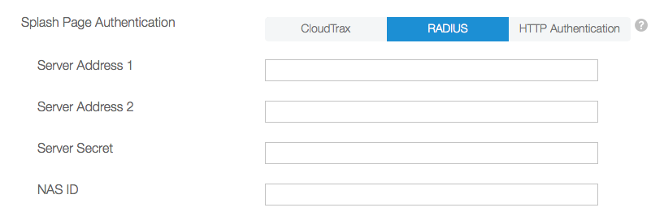

# RADIUS-based authentication

*This is preliminary documentation. It applies only to networks running under CloudTrax 4.*

CloudTrax may be configured to authenticate users using an external RADIUS server. RADIUS servers are available from the [FreeRADIUS project](http://freeradius.org) and with Microsoft Windows Server, among others. Chapter 2 of the [FreeRADIUS Technical Guide](http://networkradius.com/doc/FreeRADIUS%20Technical%20Guide.pdf) provides a good introduction to RADIUS in general.

The screenshot below shows the Configuration panel that appears in the CloudTrax Dashboard when you select the "RADIUS" option for "Splash Page Authentication".  

If your users are going to be logging in from a CloudTrax-hosted internal splash page (referred to as a "Custom" splash page in the Dashboard) , you'll need to make sure that splash page contains a RADIUS-authentication-compatible login form. Refer to [Internally Hosted splash pages](../../splash_pages/custom) for details.

If your users are logging in from an external, UAM-based splash page, refer to the documentation in [Externally Hosted splash pages](../../splash_pages/external). The CloudTrax Help Center also provides a short [tutorial introduction](https://help.cloudtrax.com/hc/en-us/articles/205014660-Externally-Hosted-Splash-Page-with-RADIUS-Authentication-on-5xx-and-later-firmware) to using RADIUS with an Externally Hosted splash page.

*Configuration of specific RADIUS servers is outside of the scope of this document.*

##### Server Address 1 #####
##### Server Address 2 #####
The Hostname or IP address of the RADIUS server. Up to two RADIUS servers may be specified.

Example: `radius_server.example.com`

##### Server Secret #####
The shared secret maintained independently by both the RADIUS client (the Access Point) and the RADIUS server. 

##### NAS ID #####
A Network Access Server identifier may be provided to supply additional out-of-band information to the RADIUS server during the authentication request. This will typically be your SSID.
