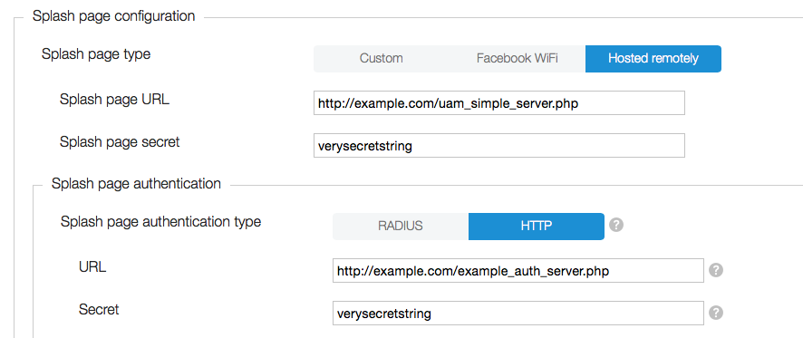

# Externally Hosted splash pages

* [Introduction](#intro)
* [Overview](#overview)
* [The redirect URL](#redir-url)
* [Pre-login: responding to `'notyet'`](#notyet)
	* [Building a log-in form](#building-login-form)
		* [userurl](#userurl)
	* [Encoding the password](#encoding-pw)
	* [Redirecting the encoded password](#build-redir-url)
	* [Using 'redir' parameter](#redir)
	* [Session handling](#session)
* [Post-authentication: responding to `'success'` and `'failed'`](#post-authentication)

<a name="intro"></a>
## Introduction

CloudTrax' external splash-page facility allows you to host your own splash pages and control every aspect of the log-in and authentication process. It requires you to code a splash-page implementation on a server that responds to the protocol described in this document. You also need to use the CloudTrax Dashboard to specify the URL address of your splash-page server code, as well as specify the type of back-end authentication service you are using, either [RADIUS](../../authentication/radius/) or [HTTP Authentication](../../authentication/http). PHP sample code is provided to help clarify the process.

Here's a sample of what the Dashboard settings might look like for a typical setup:



<a name="overview"></a>
## Overview
If you're using an externally hosted splash page, code running on the AP (Access Point) makes use of HTTP's *redirection capability* to invoke your splash server's code at several points during the Access Point's log-in/authentication process so that your sever can take appropropriate action. Redirection is the mechanism by which a web server can request a client to redirect its addressing attempt to a different URL than the one it used originally.

One such use is when an AP recognizes that a client device is attempting to access a web page using an SSID on the AP for the first time. The AP intercepts the initial page request and returns an HTTP `302 Redirect` instruction to the web browser, causing it to redirect itself to the splash page instead. The special [redirect URL](#redir-url) that the AP constructs and provides as part of the Redirect has a query-string containing parameters of interest to the splash page server. In particular, a `'res'` parameter specifies the particular operation the server is being asked to carry out.

This redirection mechanism is used on several occasions during login and authentication. The first, as mentioned above, is *pre-login*, which occurs on the initial detection of a new client's connection attempt. The  other is *post-authentication*, which occurs once the back-end authentication service has signalled to the AP whether authentication was successful or failed. The AP then uses HTTP redirection to deliver a redirect URL to the splash page indicating the authentication status.

Redirection is also used by the splash page server on one occasion to return control to the AP.  See [Redirecting the encoding password](#XXXYYY).

In both the pre-login and post-authentication case where the AP is redirecting to the splash page server, the redirection URL's query-string `'res'` parameter indicates which case it is. `'notyet'` indicates that the client has not yet been authenticated and is a signal that the splash page server needs to return a login page to the user. `'success'` and `'failed'` indicate the two possible outcomes of the attempt to authenticate, and `logout` is a response to a log-out message from the authentication service, if provided.

<a name="redir-url"></a>
## The redirect URL

Here's an example of the initial redirect URL constructed by the AP and redirected by the web client to your splash page server code to initiate the log-in sequence:

````
http://example_server.com/uam_simple_server.php?res=notyet&uamip=10.255.224.1&uamport=8082&mac=64-76-BA-8A-D3-58&called=AC-86-74-3B-7A-C0&ssid=Howards%20Test%20Network%201&nasid=100.101.102.103&userurl=http%3A%2F%2Fwww.mlsite.net%2Fblog%2F%3Fp%3D1409&challenge=ACC28255A7A0122D682AFE0653F7440F0C19E6E9E89FABC03EA2CA82D791B90C
````

The URL of the splash page host and its server code, http://example.com/uam_server.php, would have been specified by you in the CloudTrax Dashboard. The `'res'` parameter is set to `'notyet'`, telling the splash page server that the client has not yet been logged in, and that it should build and return a log-in form.

The key-value pairs present in the redirect URL's query-string are as follows.

parameter | description
----- | -----
`res` | One of `'notyet'`, `'success'`, `'failed'`, or `'logoff'`.
`uamip` | Internal address of the AP. Used by the splash page server to build a URL to the AP to return an encoded password to it. See [Redirecting the encoded password](#build-redir-url).
`uamport` |  AP port. Used together with `uamip` above to build a URL to the AP.
`mac` | MAC address of the client device .
`called` | MAC address of eth0 on the AP. This is the same MAC address that shows up in CloudTrax.
`ssid` | SSID network name.
`nasid` | ID of the Network Access Server, if one has been specified.
`userurl` | url-encoded web page requested by the user, eg "http%3A%2F%2Fwww.google.com%2F".
`challenge` | Provided by the AP. Used by server's log-in code, along with a shared secret, to produce an encoded password. The length of time the challenge is valid for is linked to the "Block duration of XX minutes" value listed in CloudTrax. The default value is 30 minutes.

Let's walk through a sequence of messages to the splash page server and its responses as it proceeds through a typical log-in and authentication process.

<a name="notyet"></a>
## Pre-login: responding to `'notyet'`

Your splash page server code needs to do a few things in response to receiving a `"res=notyet"` message from the AP. `'notyet'` indicates that the user has not yet been authenticated and marks the first step in the logging-in process. In response to receiving this message, your splash-page server needs to:

1. [build and return a log-in page to the user](#building-login-form),
2. [encode the password it gets back](#encoding-pw), and
3. [build a special redirection URL for the AP](#build-redir-url).

Let's walk through all three steps in code.

<a name="building-login-form"></a>
#### Building a log-in form

Here's a snippet of code from [uam_simple_server.php](./code/php/uam_simple_server.php) that checks the contents of the query-string in the *transport URL* shipped to it from the AP, and accordingly builds a log-in form for the user to fill out.

```` php
<html>
<body>

<?php $res = $_GET["res"];
	if ($res === "notyet") {
?>
<h2>Please Log in</h2>
<form method="POST" action="uam_handle_form.php">
  	<label>User Name: <input type="text" name="username"></label><br/>
  	<label>Password: <input type="text" name="password"></label><br/>
  	<input type="hidden" name="challenge" value="<?php echo $_GET["challenge"] ?>">
  	<input type="hidden" name="uamip" value="<?php echo $_GET["uamip"] ?>">
  	<input type="hidden" name="uamport" value="<?php echo $_GET["uamport"] ?>">
  	<input type="hidden" name="userurl" value="<?php echo $_GET["userurl"] ?>">
  	<input type="submit">
</form>
<?php
	} else if ($res = "success" ) {
		# etc ...
	}
?>
</body>
</html>
````

Note the use of hidden fields to hold the key-value pairs that were passed to the server in the transport URL's query-string. These will subsequently be POSTed to the "uam_handle_form.php" code that uses the `"challenge"` to encode the password.

<a name="userurl"></a>
#### `'userurl'`
The AP will redirect the user to the requested URL on conclusion of a successfully authenticated login. In that eventuality, the role of the splash-page server is concluded, and it will *not* be called again with the query-string parameter 'res' = 'success'. The `'userurl'` query-string parameter contains that redirection URL.

You might notice by the way that the `action` parameter in our login form above dictates that we're POSTing to a separate PHP script, [uam_handle_form.php](./code/php/uam_handle_form.php), as already noted. It's not necessary to do this, and if in fact you omit the `action` parameter, you end up with the single-file server solution shown in [splash.php](./code/php/splash.php). Doing it the way we're doing it here makes the code a bit easier to follow in our opinion, but you can choose either implementation on which to base your own server.

<a name="encoding-pw"></a>
#### Encoding the password

The first thing that [uam_handle_form.php](./code/php/uam_handle_form.php) needs to do is make some local copies of the variables that were POSTed to it.  This just puts them in a slightly more convenient form for use. The `"challenge"` that was originally generated by the AP is passed into the function that's going to do the encoding, along with the `$uam_secret` at the top of the file. This is the shared secret we made available to CloudTrax when we initially configured the splash server in the Dashboard. Keep in mind that the length of time the challenge is valid for is linked to the "Block duration of XX minutes" value listed in CloudTrax. The user should attempt to login before this timeout is reach. The default value is 30 minutes.


```` php
<?php
	$uam_secret = "verysecretstring";

	function encode_password($plain, $challenge, $secret) {
		# ...
	}

	$username = $_POST["username"];
	$password = $_POST["password"];
	$uamip = $_POST["uamip"];
	$uamport = $_POST["uamport"];
	$challenge = $_POST["challenge"];

	$encoded_password = encode_password($password, $challenge, $uam_secret);
````

Note that the `"userurl"` variable hasn't been unpacked at this point. We'll deal with that in a bit.

And here's the function that does the encoding. Cyptographically, the routine encodes the secret using PHP's `md5()` [hash-encoding](http://php.net/manual/en/function.md5.php) functionality .

```` php
function encode_password($plain, $challenge, $secret) {
	if ((strlen($challenge) % 2) != 0 ||
	    strlen($challenge) == 0)
	    return FALSE;

	$hexchall = hex2bin($challenge);
	if ($hexchall === FALSE)
		return FALSE;

	if (strlen($secret) > 0) {
		$crypt_secret = md5($hexchall . $secret, TRUE);
		$len_secret = 16;
	} else {
		$crypt_secret = $hexchall;
		$len_secret = strlen($hexchall);
	}

	/* simulate C style \0 terminated string */
	$plain .= "\x00";
	$crypted = '';
	for ($i = 0; $i < strlen($plain); $i++)
		$crypted .= $plain[$i] ^ $crypt_secret[$i % $len_secret];

	$extra_bytes = 0;//rand(0, 16);
	for ($i = 0; $i < $extra_bytes; $i++)
		$crypted .= chr(rand(0, 255));

	return bin2hex($crypted);
}
````

Note also the use of PHP's [bitwise exclusive-or](http://php.net/manual/en/language.operators.bitwise.php) operator, `^`, in the line:

```` php
 	$crypted .= $plain[$i] ^ $crypt_secret[$i % $len_secret];
 ````

The full source for [uam_handle_form.php](./code/php/uam_handle_form.php), by the way, contains some additional debugging gear we're not showing here. It might be useful if you want to view the contents of what was POSTed or the composition of the redirection URL it builds to send back to the Access Point. Which coincidentally is our next topic.


<a name="build-redir-url"></a>
#### Redirecting the encoded password

The last thing your server needs to do in responding to `'notyet'` is to build a special URL containing the username and encoded password and return that URL to the AP so it can forward those on to the back-end authentication server.

Since this logging-in process was initially started (what seems to be a very long time ago!) by the user attempting to browse to a new web page, the URL we're constructing would normally be returned back to the user's web browser, which would not be very useful. What we really want to do is return the URL to the AP instead.

We do this by using the same HTTP redirection capability we [discussed earlier](#http-redirection), where a `302 Redirect` was used by the AP to call the splash-page server with a `notyet` message. Here we'll do the same thing but in reverse, allowing the AP to take over the flow of control once again.

This is the reason for the existence of the two POSTed variables, `$uamip` and `$uamport`, which are used together to build the URL address of the AP, as in

```` php
		$redirect_url = "http://$uamip:$uamport/logon?" .
	    	"username=" . urlencode($username) .
    		"&password=" . urlencode($encoded_password);
````
This URL, when fully filled out, will look something like this:

````
	http://10.255.224.1:8082/logon?username=testuser&password=d14b2343e44f19a5d37fc83f68bc1daae123
````
The IP address shown is an *internal* one (it's only for use within your local area network and is not addressable across the greater Internet),  and may differ depending on your particular setup.

Finally, the PHP directive that causes the actual redirection is this:

```` php
	header('Location: ' . $redirect_url);
````
Note this only works correctly if the `Location` header is emitted before any *textual* output. In fact, this is true for *any* HTTP header, as noted in the PHP Manual: ["Send a raw HTTP Header"](http://php.net/manual/en/function.header.php):

> Remember that header() must be called before any actual output is sent, either by normal HTML tags,
> blank lines in a file, or from PHP.

<a name="redir"></a>
####Using 'redir' parameter
One final note on using the 'Location:' directive to achieve redirection: You can change the location of the final landing page, if you so desire, by adding a `'redir'` directive to the `$redirect_url` *before* issuing the above `header()` command. For example,

```` php
    $redirect_url .= "&redir=" . urlencode("http://myportal.example.com");
````

if you use the `'redir'` parameter, the AP will automatically redirect to that URL and will not call your splash-page server with a 'res' = 'success' parameter (similar to the case [above](#userurl) when we discussed the use of  "Redirection URL").

<a name="session"></a>
#### Session handling
Our form handler contains some PHP session-handling code,

```` php
  	session_start();
  	if(isset($_POST["userurl"])) {
    	$_SESSION["userurl"] = $_POST["userurl"];
  	} else {
    	unset($_SESSION["userurl"]);
  	}
  	session_write_close();
  ````

The purpose of this code is to maintain the value of `userurl` across web-server invocations. This makes  `userurl` available to the "success"-handling code discussed below, where it is used, along with an HTML **&lt;meta&gt;** tag, to redirect the web browser to its final landing page, if that was specified by the user.

<a name="post-authentication"></a>
## Post-authentication: responding to `'success'` and `'failed'`

```` php
	# "res"==="notyet" case discussed above
	}
	else if ($res === "success") {
		$redir = $_SESSION["userurl"];
	  	if(isset($redir)) {
	  		echo "<head>";
    		echo '<meta http-equiv="refresh" content="3;URL=\'' . $redir . '\'">';
    		echo "</head>";
    	}
    	else {
    		echo "<h2>Log-in successful!</h2>";
    	}
	}
	else if ($res === "failed") {
		echo "<h2>Whoops, failed to authenticate</h2>";
	}
	else {
		# ... logoff case remains
	}
````

The two `if ($res === ...)` statements, for "success" and "failed", deliver the two possible results of the back-end authentication. If authentication was successfull, we use an HTML **&lt;meta&gt;** tag to redirect the web browser to its final landing page, getting the value of `userurl` from our `$_SESSION` dictionary. If authentication failed, our server simply notes the fact. In a more realistic scenario, we would have likely posted a log-in form explaining the failure and allowing the user to attempt to log-in again.

Alternatively, in the event that the splash-page server had determined that the user had made too many attempts to log in at this point, we could have posted a message stating they'd been locked out for a certain amount of time.


