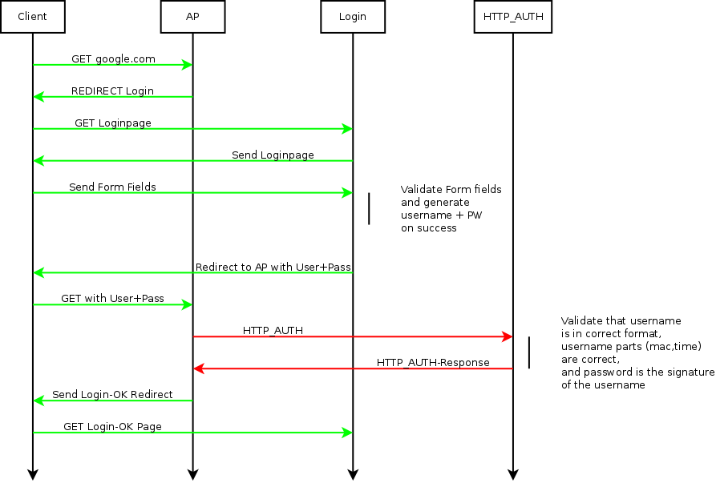

# UAM Splash Authentication click-to-enter page

The normal CloudTrax splash page allows a click-to-enter style authentication. UAM Splash Authentication does not directly allow this kind of page because the UAM page is designed to exchange a username and password. This article will show how UAM Splash Authentication can be used for click-to-enter style authentication.

## Click-to-Enter page

A click-to-enter page can have many different elements. For example an e-mail field could be used that gets stored in a database. We assume that it is using an informative text for the user, a field (accept checkbox) which is evaluated by the backend and an submit button. Additional, different or even less fields are possible.

The user is in this example expected to enable the checkbox and then press the OK button. The user should only get access when the UAM page server verified that the user accepted the TOS.

```
 ----------------------------------------
|                                        |
|        IMPORTANT TEXT                  |
|        EVEN MORE IMPORTANT TEXT        |
|        FINE-PRINT                      |
|                                        |
|        [ ] accept TOS                  |
|                                        |
|               [OK]                     |
|                                        |
 ----------------------------------------
```

## Authentication process

The basic idea is to use the username as auto-generated id and the password as signature for the username. Both can be used together to validate a user login.



The user is still automatically redirected to the remote login page when he tries to access the internet. But this time no username and password fields are shown. Instead a different set of fields are presented which he has to fill out. A press on the ok button submits the content of these fields back to the login server.

The task of the login server is then to validate the forms. The UAM login page server has to generate a new username and password when the content is validated successfully. The username should be based on the client mac address and the current time. The password on the other hand should be used as signature and hard to guess. A good approach is to create the sha256_hmac of the username together with a unique secret that is only known to the server.

Both username and password are then returned to the client browser. The browser of the client will submit the username and password automatically to the AP which then tries to validate them.

The HTTP authentication backend is expected to first validate the username. If the username doesn't contain the mac of the current user or if the timestamp in the username is outside an acceptable range then the user has to be rejected. If the username looks valid then the signature of the username has to be generated with the same algorithm as used by the splash page. The authentication backend must only return a success message when the submitted password matches the generated signature.

The client browser will then be redirected to the login page for the success message. The UAM remote login page can then display or redirect to any page it wants.

## Recommendations

The accounting messages can be disabled via the udsplash ssid option "disable_accounting".

## Example

### Configuration in the cloudtrax dashboard:

```
Splash page URL (UAM): http://1.2.3.4/test/uam.php
Splash page secret (UAM): toosecretstring
Splash page authentication URL (HTTP Auth): http://1.2.3.4/test/server.php 
Splash page authentication Secret (HTTP Auth): verysecretstring
```

### Runtime environment:

```
Client MAC: 02:ba:de:af:fe:01
Time (unix timestamp): 1440596666
```

### Sever configuration:

```
Secret used for the signature: evenmoresecretstring
```

### UAM splashpage process

The user should automatically be redirect to the splash page when its browser is trying to access a webpage.

```
http://1.2.3.4/test/uam.php?res=notyet&...&mac=02-BA-DE-AF-FE-01&...
```

The page has to validate its parameters and create a form with hidden fields to store things like the challenge or the client mac address.

When the user has filled the form and pressed, the splash page has to create a new temporary username and password which will later be used to verify that the user of this client went through the splash page. Here we use SHA256_HMAC. Base64 is chosen instead of the normal hex representation to avoid that the generated password gets larger than the limit of 63 characters.

```php
$username = 02-BA-DE-AF-FE-01 . '_' . 1440596666;
$password = base64_encode(hash_hmac('sha256', $username, 'evenmoresecretstring', true));
```

In this example the splash page would generate:

```
Username: 02-BA-DE-AF-FE-01_1440596666
Password: FuDiZi//mEFgleZkUW67L0ZtoaEjEgugLbi3nHCkZHw=
```

### Authentication Process

The AP will try to decode the supplied password and create an authentication request with both username and (re-encrypted) password for the HTTP API server. First the server has to decode the password again.

```
username: 02-BA-DE-AF-FE-01_1440596666
password: FuDiZi//mEFgleZkUW67L0ZtoaEjEgugLbi3nHCkZHw=
mac: 02:BA:DE:AF:FE:01
```

The username has to be split first into a MAC and a timestamp again. The retrieved MAC has to match the MAC address of the authentication request.

```php
/* split into mac and timestamp */
$ret = preg_match('/^(?P<mac>([A-F0-9]{2}\-){5}[A-F0-9]{2})_(?P<timestamp>[0-9]+)$/',
		  $username, $matches);
if (!$ret)
	return FALSE;

/* check if mac is the same */
if (str_replace(':', '-', $mac) != $matches['mac'])
	return FALSE;
```

The time has to be checked to make sure it is not in the future nor too far in the past. A two minute window should be acceptable.

```php
/* check if token comes from the future */
$now = time();
if ($now < $matches['timestamp'])
	return FALSE;

/* check if token is too old */
if (120 < ($now - $matches['timestamp']))
	return FALSE;
```

As last step the signature has to be generated and has to be compared with the $password

```php
/* generate signature and compare with the password */
$signature = base64_encode(hash_hmac('sha256', $username, 'evenmoresecretstring', true));
if ($signature != $password)
	return FALSE;
```

A reply as explained in HTTP API documentation has to be sent when everything went fine. The AP will then send the user back to the splashpage which then can take appropriate actions.

### Source Code

A complete example can be found under in the code directory.

 * Splashpage: uam.php
 * HTTP API server: server.php
